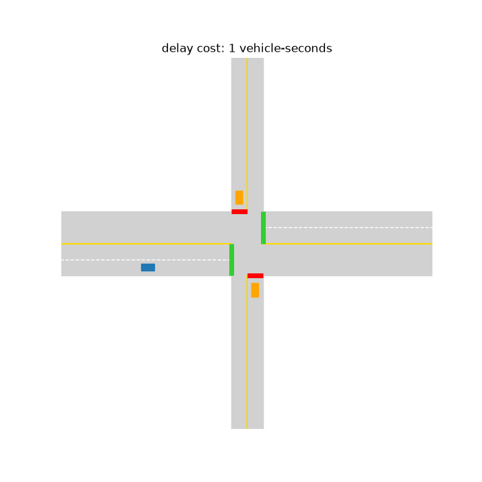

# Adaptive, Camera-Augmented Traffic Signal Control

Make signalized intersections more efficient purely by **re-timing the lights**, using
existing sensors plus added cameras, with a controller that **learns from the reward**
rather than being hand-tuned. This repo is **Milestone 1**: a small, transparent,
single-intersection microsimulator and a learning controller that has to beat the
engineered baselines on **total vehicle-delay subject to a fairness cap**.

<p align="center">
  
  <br>
  <em>Phase 1 — the learned controller holding the highway green and clearing the side
  street just in time (delay cost ticking up top).</em>
</p>

> Honest framing (see `~/.claude/plans/...` plan and the research that grounds it):
> camera/AI adaptive control already ships commercially (NoTraffic, InSync, Surtrac),
> and realistic gains from re-timing are bounded (~10% on poorly-tuned, under-saturated
> corridors; ~0 or negative under saturation). M1 is about proving the mechanism and
> the objective on the motivating divided-highway/side-street case — not claiming novelty.

## What's here

| Path | Purpose |
|---|---|
| `sim/` | Microsimulator: vehicles, safe-following motion, signal safety envelope (`signal.py`), per-vehicle delay accounting |
| `envs/intersection_env.py` | Gymnasium env: observation (incl. camera-horizon lookahead), `hold/switch` action, delay+fairness reward |
| `controllers/` | `fixed_time`, `actuated` (gap-out/max-out), `max_pressure` baselines + `dqn` learner |
| `metrics/` | Aggregate seeds and render the comparison table |
| `scenarios/` | `divided_highway_side_street.yaml` |
| `viz/render.py` | Render a rollout to a GIF for the eyeball check |
| `experiments/` | `train.py`, `eval.py` |

## Quick start

```bash
python -m venv .venv && source .venv/bin/activate
pip install -e .            # baselines + eval (no torch needed)
pip install -e '.[learn,viz]'   # add DQN training + GIF rendering

# Compare the engineered baselines:
python -m experiments.eval --scenario divided_highway_side_street --seeds 5

# Train the learning controller, then include it in the comparison:
python -m experiments.train --episodes 200 --out runs/dqn.pt
python -m experiments.eval --dqn runs/dqn.pt --seeds 5

# Eyeball it:
python -m viz.render --controller max_pressure --seconds 300 --out runs/sim.gif
```

## The objective

Reward per step is `-(total delay this step) - beta * (fairness excess this step)`.
Minimising the discounted return minimises aggregate vehicle-delay (Webster's classic
objective, == the user's "sum of per-car timers") while a per-approach **max-wait cap**
prevents the side street from being starved — the documented failure mode of every
adaptive system studied. A run that breaches the cap is a fairness failure regardless
of its delay number.

## Success criterion (M1)

Learning controller achieves **lower total delay than `fixed_time` and `actuated`,
competitive-with-or-better-than `max_pressure`, with no fairness-cap violations**,
across demand levels. See the plan's verification section.

## Not yet (later milestones)

SUMO port + multi-intersection green-wave coordination (M2), camera perception
pipeline (M3), NTCIP/NEMA field interoperability + safety certification (M4),
shadow-mode pilot (M5).
